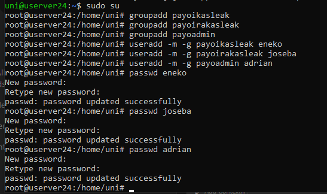

# CUPS

**-Inprimagailuen portuak:**

<figure><figcaption></figcaption></figure>

### Windows bezero Cups-eko inprimagailu batetik inprimatu:

<figure><figcaption></figcaption></figure>

\-

<figure><figcaption></figcaption></figure>

\-

<figure><figcaption></figcaption></figure>

### **Linux bezero Cups-eko inprimagailu batetik inprimatu:**

-Bezero hau erabiliko dugu:\

<figure><figcaption></figcaption></figure>

-Ubuntutik Cups ikusten da:

<figure><figcaption></figcaption></figure>

-”Inpresoras” barruan Cups-eko inprimagailua ikusten da:

<figure><figcaption></figcaption></figure>

-”Imprimir\

<figure><figcaption></figcaption></figure>

-Hemen ikusten da inprimagailua:

<figure><figcaption></figcaption></figure>

-Cups-etik ikusten dena:

<figure><figcaption></figcaption></figure>
