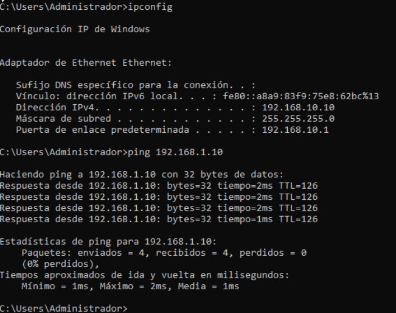

# GPO

**-IKASLEEN "Fondo de pantalla" ezarri:**

<figure><figcaption></figcaption></figure>

<figure><figcaption></figcaption></figure>

Configuración de usuario → Plantillas administrativas → Escritorio → Fondo de escritorio

<figure><figcaption></figcaption></figure>

<figure><figcaption></figcaption></figure>

\
&#xNAN;**-IRAKASLEAK  "Panel de control" gabe:**

<figure><figcaption></figcaption></figure>

<figure><figcaption></figcaption></figure>

<figure><figcaption></figcaption></figure>

**-Joseba erabiltzailea saioa pizterakoan "notak" aplikazioa zabaltzea:**

<figure><figcaption></figcaption></figure>

<figure><figcaption></figcaption></figure>

<figure><figcaption></figcaption></figure>

**-Eneko erabiltzailea ezin du erabili "Administrador de tareas":**

<figure><figcaption></figcaption></figure>

<figure><figcaption></figcaption></figure>

<figure><figcaption></figcaption></figure>
